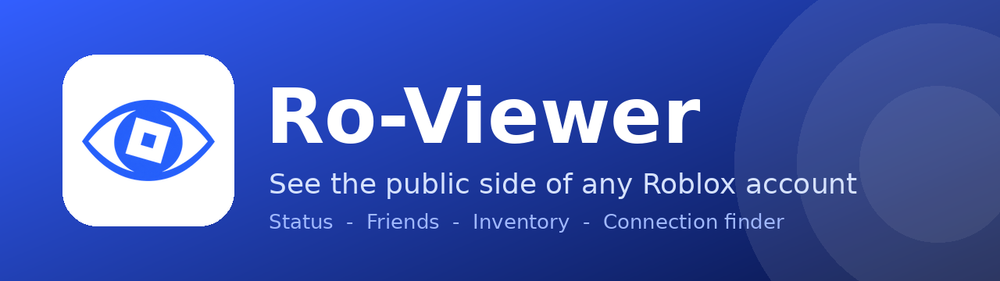

# Ro-Viewer

A local website that shows the **public** side of Roblox accounts: status, friends, inventory, avatar, games, communities, and how two players are connected through friends.

It runs on your own PC. It never asks for a password, cookie or API key.

## Features

| | |
|---|---|
| **Account tracker** | Save usernames in `data.json`. See Active/Banned, joined date, bio and friends. Optional auto-check with a notification if a ban status changes. |
| **Friends** | Pictures, display names, @usernames, online/offline dots. Click a friend to view their details without tracking them. |
| **Inventory** | Items with pictures, Robux prices, limited serial numbers and sale status, plus an estimated total. |
| **Avatar** | What a player is wearing, with prices and a worn-items total. |
| **Connection finder** | Live search for the chain of friends between you and any player. Option to skip unavailable users. |
| **Themes** | Blue and white, light or dark. |
| **Diagnostics** | Tests every Roblox endpoint the app uses and shows exactly what works. |

## Install on Windows

1. Install **Node.js 18 or newer** from https://nodejs.org (LTS).
2. Download or clone this folder.
3. Double-click **`start.bat`**, then open **http://localhost:3200**.

No `npm install` is needed. Your saved accounts live in `data.json` next to `server.js`.

## What Roblox does not make public

Ban reasons, mute status and reasons, "last played", and some online details are only visible to the account owner or require a login. Ro-Viewer shows "not public" instead of guessing. Inventory totals are estimates, and private inventories cannot be read.

## Privacy and safety

- Uses only public Roblox endpoints, through a small local proxy on your machine.
- Stores no passwords, cookies or tokens.
- Not affiliated with or endorsed by Roblox Corporation.

## License and credit

Released under the [MIT License](LICENSE). You can copy, change and share it.

**If you customize it and republish it, please give credit to HafizIbrahimSuriya** and keep the copyright notice in the license file.

